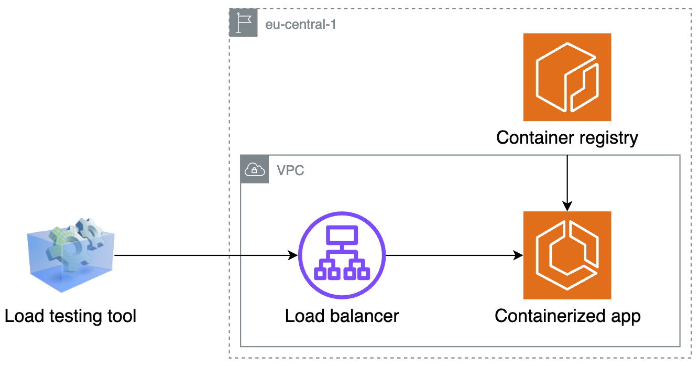

# Practical ECS scaling

This repository contains a working example application used in my blog series on [practical ECS scaling](https://dev.to/ivicak/practical-ecs-scaling-an-introduction-4f26).

The blog series answers questions such as:

* How effective is it to vertically scale an application that has a memory leak? 
* Can a CPU-heavy application perform better with more CPU resources? 
* Should you horizontally scale your application based on response times?

It is based on an article about [Amazon ECS Scalability Best Practices](https://containersonaws.com/presentations/amazon-ecs-scaling-best-practices/) by Nathan Peck.

## The app

The application itself is built in Flask and its infrastructure is managed with AWS CDK for Python. The app has several 
REST API endpoints:

* `/cpu_intensive`, simulating a CPU-intensive task. Calculates the square root of `64 * 64 * 64 * 64 * 64 * 64 ** 64` on each request.
* `/memory_leak`, simulating a [memory leak](https://en.wikipedia.org/wiki/Memory_leak). Adds 1MB of memory on each request.
* `/long_response_time`, simulating increasingly longer responses from a busy downstream system (e.g. a database). Sleeps for 2ms for each request received since the app was started.